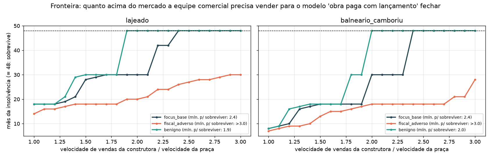
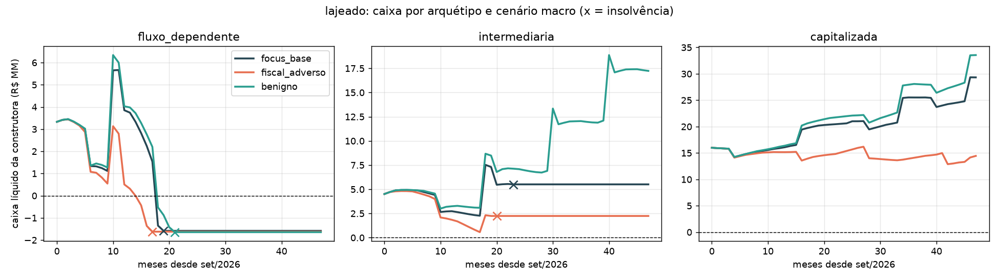
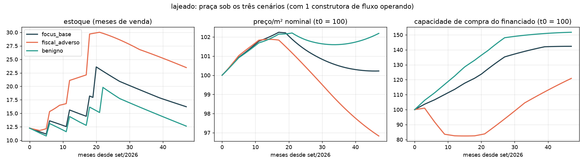
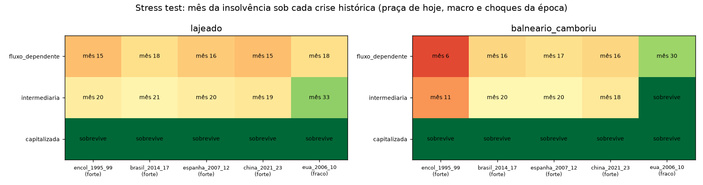

# 🏗️ imobsim — "obra de hoje paga com lançamento de agora" fecha?

**Modelo de estoque e fluxo, mensal e determinístico, para testar sob quais
condições uma incorporadora que financia a obra em andamento com o recebível
do próximo lançamento sobrevive** — cruzando três cenários macro (Selic, SBPE,
INCC, CDI), duas praças (Lajeado/RS e Balneário Camboriú/SC) e três
arquétipos de construtora.

> ## ⚠️ Isto é um estudo, não uma previsão
> Não é modelo de previsão de data nem de empresa específica. É **modelo de
> mecanismo**: mostra qual estrutura de caixa quebra, o que precisa acontecer
> para ela não quebrar e quanto o macro desloca o resultado. Os parâmetros de
> praça são estimativas a partir de fontes públicas, não dados primários.
> Trate toda saída como *"sob estas premissas"*.

---

## Por que este projeto existe

Em praças pequenas com boom de demanda (Lajeado depois das enchentes de 2024,
por exemplo) é comum ouvir que a obra em andamento está sendo paga com a
entrada e as parcelas do lançamento seguinte. Isso funciona enquanto o
próximo lançamento vende mais rápido que o anterior. A pergunta do estudo é
simples: **quanto mais rápido, e por quanto tempo, antes de o macro ou o
próprio estoque da praça fecharem a conta?**

A ideia é separar o que é **estrutural** (a tendência que sobrevive a todos os
cenários) do que é **conjuntural** (o que depende de Selic cair ou não).

## A resposta curta (parâmetros iniciais, horizonte de 48 meses)

Mês da insolvência por arquétipo, praça e cenário macro:

| Arquétipo | Praça | fiscal_adverso | focus_base | benigno |
|---|---|---|---|---|
| `fluxo_dependente` (caixa único, lança a cada 6 meses +30%) | Lajeado | fev/2028 | abr/2028 | jun/2028 |
| `fluxo_dependente` | Balneário Camboriú | jun/2027 | jan/2028 | fev/2028 |
| `intermediaria` (afetação, mas lança por calendário) | Lajeado | mai/2028 | ago/2028 | **sobrevive** |
| `intermediaria` | Balneário Camboriú | jan/2028 | mai/2028 | mai/2028 |
| `capitalizada` (afetação, reserva, lança por estoque) | ambas | **sobrevive** | **sobrevive** | **sobrevive** |

Três leituras:

1. **A construtora de fluxo quebra em todos os macros.** O cenário só desloca
   o mês (4 meses de amplitude em Lajeado, 8 em Balneário Camboriú). Isso é
   estrutural, não conjuntural.
2. **Para sobreviver 48 meses ela precisaria vender a 2,4x a velocidade da
   praça** no cenário Focus, 1,9x no benigno — e nenhuma velocidade a salva no
   adverso (fronteira abaixo).
3. **Efeito emergente:** ao lançar a cada 6 meses com crescimento de 30%, a
   própria construtora empurra o estoque de Lajeado de 9 para 17 meses de
   venda e derruba o preço, sabotando a própria VSO. Saturação induzida pelo
   lado da oferta.







Os gráficos equivalentes para Balneário Camboriú estão em
[`docs/caixa_balneario_camboriu.png`](docs/caixa_balneario_camboriu.png) e
[`docs/praca_balneario_camboriu.png`](docs/praca_balneario_camboriu.png); a
tabela completa (caixa mínimo/final, variação de preço, estoque, VSO média)
está em [`docs/resumo_grade.csv`](docs/resumo_grade.csv).

## Como o modelo funciona

### Três eixos independentes

```
imobsim/macro.py          Selic, taxa SBPE, INCC, CDI (séries mensais exógenas)
imobsim/praca.py          demanda (fluxo base + degrau de evento), capacidade de
                          compra, estoque, preço com histerese, confiança
imobsim/incorporadora.py  obras, caixa (pool ou afetação), plano empresário,
                          repasse/distrato, política de lançamento
imobsim/sim.py            loop mensal, grade de cenários, fronteiras
imobsim/fontes.py         SGS e Focus (BCB) com snapshot offline em imobsim/dados/
imobsim/crises.py         episódios históricos (macro + choques) para stress test
run.py                    gera CSV + gráficos em ./out; --stress roda as crises
```

Trocar praça, macro ou arquétipo é trocar um objeto. Lajeado e Balneário
Camboriú diferem em **qual canal macro morde**: em Lajeado é a taxa SBPE
contra a renda do comprador financiado; em BC é o CDI como custo de
oportunidade do investidor.

### A regra central: afetação

- `afetacao=False` — caixa único. Recebível do lançamento B paga obra de A.
  Solvência passa a depender de continuar lançando e vendendo mais rápido que
  o mercado.
- `afetacao=True` — caixa por SPE. Cada obra vive do próprio recebível e do
  plano empresário; a holding só cobre o buraco com sua reserva. Pode dar
  insolvência com caixa consolidado positivo (dinheiro preso em SPE de obra
  não entregue), que é exatamente o que a afetação existe para produzir.

### Fluxo do comprador na planta

| Parcela | Quando | Condição |
|---|---|---|
| Entrada (20%) | na venda | — |
| Obra (20%) | parcelas até a entrega, corrigidas por INCC | — |
| Repasse (60%) | na entrega | **se** o banco aprova (renda vs. taxa vigente); senão distrato: devolve 50% do pago em 6 meses e a unidade volta ao estoque como "pronto" |

### Cenários macro (set/2026 → ago/2030)

| Cenário | Selic | INCC |
|---|---|---|
| `focus_base` | mediana Focus de set/2026: 13,75 fim-26 → 12,0 fim-27 → 10,5 fim-28 → 10,0 | 6,5% → 5,0% |
| `fiscal_adverso` | choque fiscal pós-eleição: sobe a 15,5 no 1º sem/2027 e fica alta | 6,5% → 9,0% → 7,0% |
| `benigno` | ajuste fiscal crível: 11,0 fim-27 → 9,0 fim-28 → 8,5 | 6,5% → 4,5% |

A taxa SBPE segue `5 + 0,55 × Selic` (aproximação histórica) e o CDI é
igualado à Selic.

### Qualquer momento: cenários a partir de dados

Além dos três cenários estilizados, o macro pode vir direto do Banco Central.
O pacote carrega um snapshot de séries mensais do SGS desde jul/1994 (Selic
4189, INCC-DI 192, IPCA 433, taxa média SBPE regulada 20774) e da última
divulgação Focus, então tudo roda offline; `python -m imobsim.fontes`
atualiza o snapshot.

| Especificação | O que faz |
|---|---|
| `historico:2014-01` | usa as séries observadas a partir de jan/2014; SBPE observada de mar/2011 em diante e a regra antes disso |
| `focus:2026-09-04` | mediana Focus daquela data (Selic e IPCA por ano), interpolada a partir da Selic e da SBPE observadas naquele mês; INCC = IPCA + 1,5 p.p. |

Qualquer função que recebe um cenário aceita essas strings, um callable ou
um DataFrame pronto:

```bash
python run.py --macros historico:2014-01 historico:2016-01 focus:2026-09-04
```

```python
from imobsim import run, historico, focus
run("historico:2014-01", "lajeado", "fluxo_dependente")   # o macro real de 2014-17
focus("2026-09-04")                                       # DataFrame do cenário Focus
```

Rodar a praça de Lajeado sob o macro observado de 2014 a 2017 (Selic subindo
a 14,25 e SBPE a 11%) quebra a construtora de fluxo em jul/2015, nove meses
antes do que o cenário Focus atual. Não é "o que aconteceu em Lajeado em
2015": é a praça de hoje sob aquele macro.

## Rodar

Requer Python ≥ 3.10.

```bash
# com uv
uv venv && source .venv/bin/activate
uv pip install -e .

# ou com pip
python -m venv .venv && source .venv/bin/activate
pip install -e .

python run.py --meses 48 --out out
```

Roda em ~2 s e escreve `resumo_grade.csv` e cinco PNGs em `./out`
(ignorado pelo git; as figuras do README ficam em `docs/`). `--macros`
troca os cenários (ver "Qualquer momento" acima).

Em notebook ou script:

```python
from imobsim import run, grade, resumo, vso_minima, crescimento_minimo

df = run("focus_base", "lajeado", "fluxo_dependente")   # DataFrame mensal
df.attrs["insolvente_em"]                                # índice do mês da quebra ou None

res = grade()                                            # 3 macros x 2 praças x 3 arquétipos
print(resumo(res))

vso_minima("focus_base", "lajeado")        # menor fator_vendas que sobrevive 48 meses
crescimento_minimo("focus_base", "lajeado")  # menor crescimento_lanc que sobrevive
```

Testes e lint:

```bash
uv pip install -e ".[dev]"
pytest
ruff check .
```

## Stress test com crises históricas

O modelo é de mecanismo, então a comparação útil com crises passadas não é
"ele teria previsto?" e sim **"esta praça e este arquétipo sobreviveriam
àquele caminho?"**. Cada episódio em `crises.py` é uma trajetória macro
(observada do SGS quando é brasileira, estilizada de fontes públicas quando
não é) mais choques datados na praça e no arquétipo: recessão vira
`renda_comprador × 0,96`, racionamento de crédito vira `entrada_pct × 1,5`,
linha bancária fechada vira `limite_credito × 0`. Cada episódio carrega o
mapeamento explícito de mecanismo real → parâmetro do modelo.

```bash
python run.py --stress        # docs/stress_crises.csv, stress_crises.png, stress_caixa_lajeado.png
```

```python
from imobsim import stress, grade_stress, resumo_stress, EPISODIOS
stress("intermediaria", "lajeado", "espanha_2007_12")          # DataFrame mensal
stress("intermediaria", "lajeado", "espanha_2007_12", com_choques=False)  # só o macro
resumo_stress(grade_stress())
EPISODIOS["china_2021_23"].mecanismo                           # crise real -> parâmetro
```



| Episódio | Encaixe | Por que entra | O que mais pesa no modelo |
|---|---|---|---|
| Encol (1995–99) | forte | o caso que gerou a Lei do Patrimônio de Afetação: caixa único entre ~700 obras | Selic de 25–50% observada no custo do plano empresário e como CDI do investidor |
| Brasil (2014–17) | forte | Selic 14,25, SBPE a 11%, distratos de ~40% das vendas, PDG/Viver/Rossi em RJ | macro observado + renda × 0,96 (2×), entrada × 1,5, demanda × 0,8 |
| Espanha (2007–12) | forte | promotoras de pré-venda + crédito bancário; juros caem e a demanda some assim mesmo | demanda × 0,5, entrada × 1,75, renda × 0,85, `limite_credito` × 0,3 |
| China / Evergrande (2021–23) | forte | pré-venda de um projeto pagando obra de outro; remédio foi escrow por projeto (afetação) | `limite_credito` × 0 por regra, confiança × 0,7, demanda × 0,6 |
| EUA / subprime (2006–10) | **fraco** | contraste: a quebra foi no crédito ao comprador e na securitização, que o modelo não tem | só a ponta da construtora: demanda × 0,6, `limite_credito` × 0,3 |

Três leituras (parâmetros iniciais, praça de hoje):

1. **A construtora de fluxo quebra entre o mês 15 e o 18 em todos os
   episódios de encaixe forte, em Lajeado.** Encol com Selic de 40% e China
   com juros caindo dão o mesmo mês. Reforça a leitura da grade principal: a
   data da quebra é da estrutura de caixa, não do macro.
2. **A intermediária sobrevive ao macro puro de Espanha, China e EUA, e quebra
   quando entram os choques de renda e crédito.** Para quem tem afetação, o
   que mata não é taxa de juros, é o comprador sumir ou o banco fechar a
   linha.
3. **Em Balneário Camboriú a Encol mata em 6 meses**, porque a praça é de
   investidor e o CDI de 50% zera a demanda. A mesma construtora em Lajeado
   dura 15. Qual canal macro morde a praça importa mais que a crise.

Limite importante: a praça é sempre a de hoje (preço, renda, estoque de
2026); só o caminho macro e os choques vêm do episódio. Não é "Lajeado em
2015", é "Lajeado de hoje se 2015 se repetisse". Os choques são
estilizações grosseiras de séries públicas, para ordem de grandeza.

## Parâmetros que mais movem o resultado (calibrar primeiro)

- `Praca.demanda_base_mensal` e `estoque_inicial` — definem a VSO de partida.
- `Praca.renda_comprador` — define quando o repasse falha.
- `Praca.degrau_inicial` e `degrau_meia_vida` — Lajeado: famílias realocadas
  ainda no mercado, absorvidas com meia-vida de 14 meses.
- `Arquetipo.pe_pct`, `reserva_inicial`, `limite_credito` — folga de caixa.
- `Arquetipo.projetos_iniciais` — a "obra de hoje": idade, tamanho, % vendido.

## Fontes para calibrar

- BC/SGS: Selic (série 432), crédito habitacional, inadimplência PF direcionado
- Focus: mediana de Selic e IPCA por ano
- FGV: INCC
- CBIC e Abrainc/Fipe: lançamentos, vendas, oferta final, distratos (mensal)
- Brain/Sinduscon VT: R$/m² e metragem regional (R$ 8.103/m² no 4T25)
- FipeZap: Balneário Camboriú / Itapema
- ESTBAN (BC): crédito habitacional por município/agência
- Defesa Civil: imóveis condenados como proxy do degrau de demanda

## Limites conhecidos

- Uma construtora por praça; contágio entre construtoras é só um choque de
  confiança na praça quando ela quebra.
- Comprador homogêneo por praça (uma renda, uma lógica de aprovação).
- Não há mercado secundário nem aluguel.
- Determinístico. Monte Carlo sobre Selic, INCC e degrau é o próximo passo
  natural (usar a dispersão do Focus como prior).
- Parâmetros de praça são estimativas a partir das fontes acima, não dados
  primários.

## Licença

[MIT](LICENSE) — Davi Janisch Maia, 2026.
